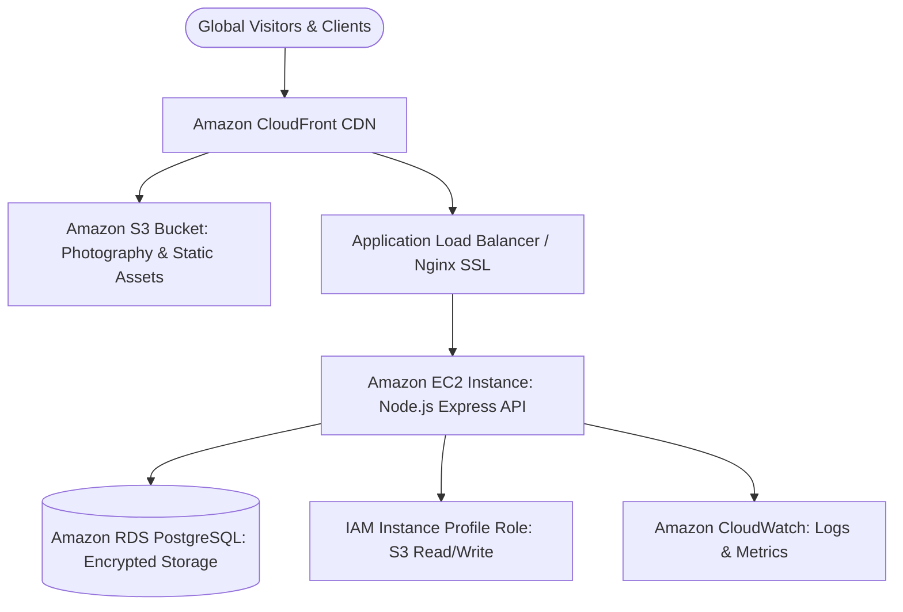

# AWS Production Deployment Guide

**Project:** Subash Studio Photography Web Platform  
**Target Infrastructure:** AWS (EC2 + RDS + S3 + CloudFront + ACM + CloudWatch + IAM)  
**Region:** `ap-south-1` (Mumbai)  

---

## 1. Architecture Overview



---

## 2. Prerequisites & AWS Resource Setup

### 2.1 Virtual Private Cloud (VPC) & Subnets
- Dedicated VPC in `ap-south-1` (`10.0.0.0/16`).
- 2 Public Subnets (for ALB / NAT Gateway).
- 2 Private Subnets (for EC2 Application and RDS Database).

### 2.2 Security Groups Configuration

| Security Group | Inbound Rules | Outbound Rules | Purpose |
|---|---|---|---|
| `sg-alb` | `443` from `0.0.0.0/0`, `80` from `0.0.0.0/0` | Port `5000` to `sg-ec2` | Public HTTPS ingress |
| `sg-ec2` | Port `5000` from `sg-alb`, Port `22` from Bastion/VPN | All traffic (`0.0.0.0/0`) | Express Node.js application |
| `sg-rds` | Port `5432` from `sg-ec2` only | None | Private PostgreSQL instance |

---

## 3. Storage Architecture: S3 & CloudFront

### 3.1 S3 Media Bucket Setup
1. Create bucket: `subash-studio-media-prod-ap-south-1`.
2. Enable **Block all public access**.
3. Enable **Bucket Versioning** to prevent accidental asset deletion.
4. Enable **Server-side encryption** with Amazon S3-managed keys (`SSE-S3`).
5. Configure Lifecycle Rules:
   - Transition original RAW/Uncompressed photography archives to `STANDARD_IA` after 90 days.
   - Transition to `GLACIER` after 365 days.

### 3.2 CloudFront Distribution with Origin Access Control (OAC)
1. Create an **Origin Access Control (OAC)** for S3.
2. Configure Origins:
   - **Origin 1 (Default `/*`):** S3 bucket for frontend SPA assets and `/uploads/*` photography media.
   - **Origin 2 (`/api/*`):** ALB / EC2 DNS for backend REST API.
3. Behavior Settings:
   - **Viewer Protocol Policy:** `Redirect HTTP to HTTPS`.
   - **Allowed HTTP Methods:** `GET, HEAD, OPTIONS, PUT, POST, PATCH, DELETE`.
   - **Cache Policy:**
     - `/uploads/*`: Caching Optimized (`Cache-Control: max-age=31536000`).
     - `/api/*`: Caching Disabled (Pass-through with `Authorization`, `Cookie`, `X-Request-Id` headers forwarded).
4. Attach ACM SSL certificate for `subashstudio.com` and `*.subashstudio.com`.

---

## 4. Database Setup: RDS PostgreSQL

1. Engine: **PostgreSQL 16.x** or **17.x**.
2. DB Instance Class: `db.t4g.micro` (Dev/Demo) or `db.t4g.small` (Production).
3. Storage: 20 GiB gp3 with Storage Autoscaling enabled up to 100 GiB.
4. Connectivity:
   - **Public Access:** No.
   - **VPC Security Group:** `sg-rds`.
5. Automated Backups:
   - Retention period: 14 days.
   - Backup window: Daily 02:00-03:00 IST.
6. Connection String:
   ```bash
   DATABASE_URL="postgresql://subash_admin:<ENCRYPTED_PASSWORD>@subash-studio-db.cxxxxxx.ap-south-1.rds.amazonaws.com:5432/subash_studio?schema=public&sslmode=require"
   ```

---

## 5. Compute Setup: EC2 Application Server

### 5.1 Instance Provisioning
- AMI: **Ubuntu Server 24.04 LTS** (ARM64 or x86_64) or **Amazon Linux 2023**.
- Instance Type: `t4g.small` (2 vCPU, 2 GiB RAM).
- Attach IAM Role `SubashStudioEC2Role` with permissions:
  - `s3:PutObject`, `s3:GetObject`, `s3:DeleteObject` on `arn:aws:s3:::subash-studio-media-prod-ap-south-1/*`.
  - `cloudwatch:PutMetricData`, `logs:CreateLogGroup`, `logs:CreateLogStream`, `logs:PutLogEvents`.

### 5.2 Server Initialization Script

```bash
#!/bin/bash
set -e

# Update and install Node.js 22.x
sudo apt-get update -y
sudo apt-get install -y curl git nginx htop
curl -fsSL https://deb.nodesource.com/setup_22.x | sudo -E bash -
sudo apt-get install -y nodejs

# Install PM2 Process Manager globally
sudo npm install -g pm2

# Setup application directory
sudo mkdir -p /var/www/subash-studio
sudo chown -R ubuntu:ubuntu /var/www/subash-studio
```

### 5.3 Nginx Reverse Proxy Configuration

Create `/etc/nginx/sites-available/subash-studio`:

```nginx
server {
    listen 80;
    server_name api.subashstudio.com;

    # Maximum client upload body size for high-resolution photographs
    client_max_body_size 25M;

    # Security Headers
    add_header X-Frame-Options "SAMEORIGIN" always;
    add_header X-Content-Type-Options "nosniff" always;
    add_header X-XSS-Protection "1; mode=block" always;

    location / {
        proxy_pass http://127.0.0.1:5000;
        proxy_http_version 1.1;
        proxy_set_header Upgrade $http_upgrade;
        proxy_set_header Connection 'upgrade';
        proxy_set_header Host $host;
        proxy_set_header X-Real-IP $remote_addr;
        proxy_set_header X-Forwarded-For $proxy_add_x_forwarded_for;
        proxy_set_header X-Forwarded-Proto $scheme;
        proxy_set_header X-Request-Id $http_x_request_id;
        proxy_cache_bypass $http_upgrade;
    }
}
```

Enable site and restart Nginx:
```bash
sudo ln -s /etc/nginx/sites-available/subash-studio /etc/nginx/sites-enabled/
sudo nginx -t
sudo systemctl restart nginx
```

---

## 6. Application Deployment Process

### 6.1 Backend Deployment
```bash
cd /var/www/subash-studio/backend

# Install dependencies
npm ci --production

# Generate Prisma client and run database migrations
npx prisma generate
npx prisma migrate deploy

# Start or reload PM2 service
pm2 start src/server.js --name "subash-backend" -i max --env production
pm2 save
pm2 startup
```

### 6.2 Frontend SPA Deployment (to S3 + CloudFront)
```bash
cd frontend
npm ci
npm run build

# Sync built static assets to S3
aws s3 sync dist/ s3://subash-studio-frontend-prod/ --delete --cache-control "max-age=31536000,immutable"
# Invalidate index.html in CloudFront
aws cloudfront create-invalidation --distribution-id <DISTRIBUTION_ID> --paths "/*"
```

---

## 7. Cost Control & AWS Budgets

1. Create AWS Budget:
   - Budget Name: `SubashStudio-Monthly-Spend-Limit`
   - Amount: `$30.00 / month`
   - Threshold Alerts:
     - 80% ($24.00): Email notification to engineering team.
     - 100% ($30.00): Urgent email notification.
2. Enable CloudWatch Billing Alarm for unexpected S3 egress spikes.
